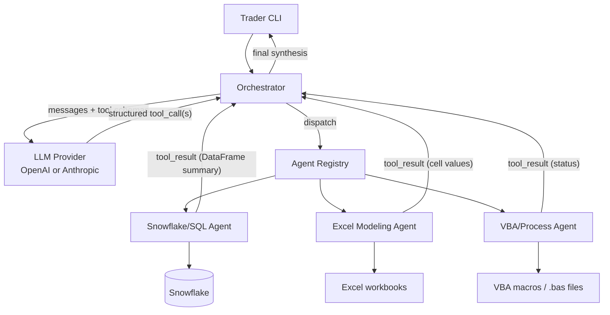
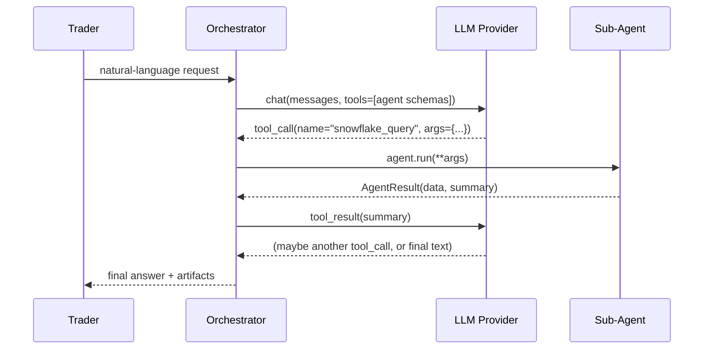
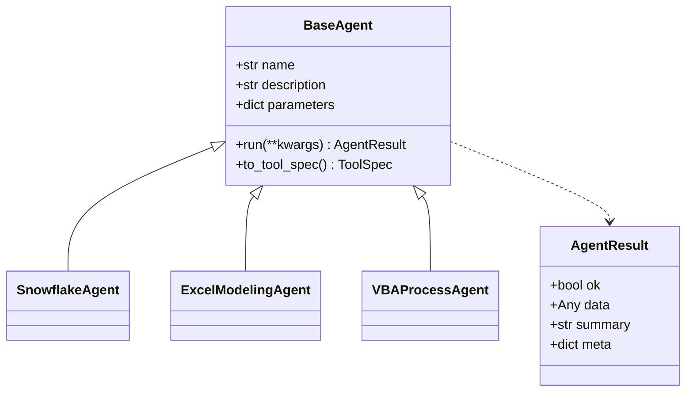

# Architecture

This document describes how the **Orchestrator** and the three **Sub-Agents**
communicate, and how the Python modules connect.

---

## 1. High-level flow

The Orchestrator is the only component that talks to the LLM. It advertises
each sub-agent to the model as a **callable tool**. The model decides which
tool(s) to call and with what arguments (native tool-calling + structured
output). The Orchestrator executes those tool calls against the real
sub-agents, feeds results back, and loops until the model produces a final
answer.



---

## 2. Tool-calling sequence



The loop continues while the model keeps emitting tool calls, bounded by
`Orchestrator.max_iterations` to prevent runaway loops.

---

## 3. Module map

| Module | Responsibility |
|--------|----------------|
| `src/pennymac_agent/main.py` | CLI (typer): `run` one-shot and interactive REPL. Builds the orchestrator and prints results. |
| `config/settings.py` | `Settings` (pydantic-settings) loads `.env`: LLM provider/keys, Snowflake creds, Excel/VBA paths, logging. Single source of truth. |
| `llm/base.py` | `LLMProvider` ABC + shared types (`ChatMessage`, `ToolSpec`, `ToolCall`, `LLMResponse`). Defines the provider-agnostic contract. |
| `llm/openai_provider.py` | Implements `LLMProvider` against the OpenAI SDK (`tools=` / `tool_calls`). |
| `llm/anthropic_provider.py` | Implements `LLMProvider` against the Anthropic SDK (`tools=` / `tool_use` blocks). |
| `llm/factory.py` | `build_provider(settings)` returns the configured provider. |
| `agents/base_agent.py` | `BaseAgent` ABC: `name`, `description`, `parameters` (JSON schema), `run()`, and `to_tool_spec()`. `AgentResult` dataclass. |
| `agents/snowflake_agent.py` | `SnowflakeAgent`: connect, run parameterized SQL, return `DataFrame`; read-only guardrail. |
| `agents/excel_agent.py` | `ExcelModelingAgent`: open registered workbook, write inputs to named ranges, recalc, read outputs. |
| `agents/vba_agent.py` | `VBAProcessAgent`: run an existing macro by name; generate a new `.bas` script. |
| `orchestrator/router.py` | Collects registered agents and builds the list of `ToolSpec`s for the LLM. |
| `orchestrator/orchestrator.py` | The dispatch loop: calls the provider, maps `ToolCall` → agent, executes, returns synthesis. |
| `utils/logging.py` | `get_logger()` — structured, level-from-env logging. |

---

## 4. The agent contract

Every sub-agent is a `BaseAgent` subclass exposing a stable contract so the
router can advertise it without special-casing:

```python
class BaseAgent(ABC):
    name: str             # unique tool name, e.g. "snowflake_query"
    description: str      # tells the LLM WHEN to use it
    parameters: dict      # JSON Schema for arguments

    def run(self, **kwargs) -> AgentResult: ...
    def to_tool_spec(self) -> ToolSpec: ...   # provider-agnostic schema
```

`AgentResult` carries both a machine payload (`data`) and a compact
human/LLM-facing `summary` so large objects (e.g. DataFrames) are not dumped
verbatim back into the model context.



---

## 5. Provider abstraction

The Orchestrator never imports `openai` or `anthropic` directly. It depends
only on `LLMProvider`:

```mermaid
flowchart LR
    Orch[Orchestrator] --> Base["LLMProvider (ABC)"]
    Base <|.. OAI[OpenAIProvider]
    Base <|.. ANT[AnthropicProvider]
    Factory[factory.build_provider] --> Base
    Settings[Settings.LLM_PROVIDER] --> Factory
```

Each provider is responsible for translating the neutral `ToolSpec` /
`ToolCall` types into its own wire format and back, so the rest of the codebase
stays identical regardless of vendor.

---

## 6. Data & control flow summary
1. CLI builds `Settings`, the LLM provider, and registers the three agents.
2. Orchestrator sends the user message plus tool schemas to the provider.
3. Provider returns either a final message or one/more structured tool calls.
4. Orchestrator maps each tool call to an agent and executes `run()`.
5. `AgentResult.summary` is returned to the model as a tool result.
6. Steps 2–5 repeat until the model returns a final answer or `max_iterations`
   is reached.
