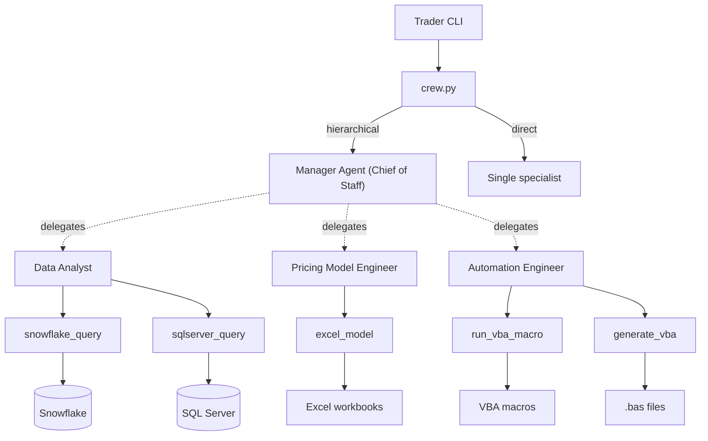
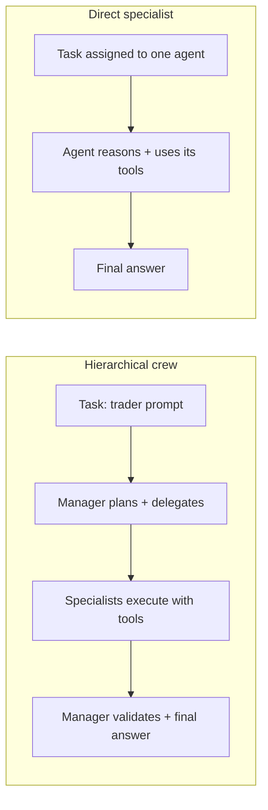
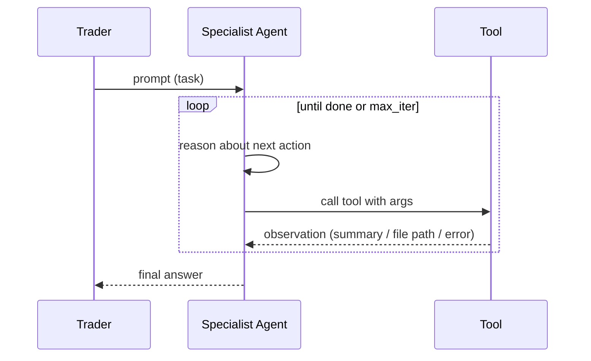
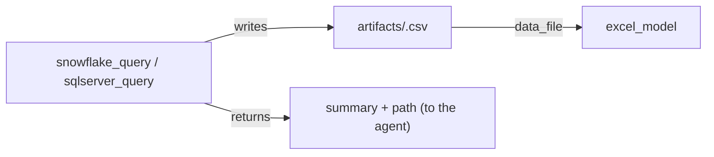
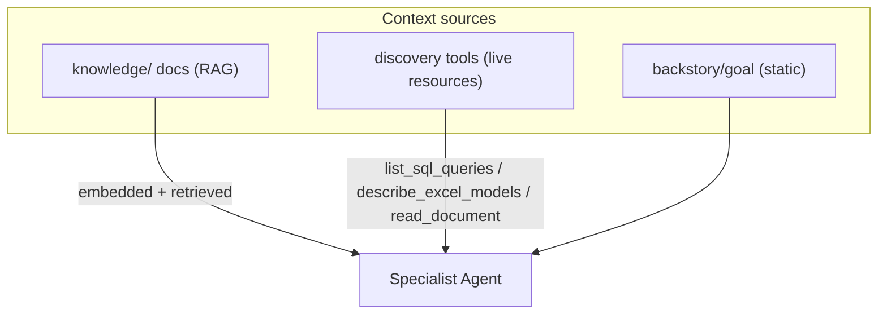
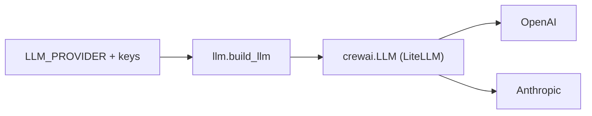

# Architecture

This framework is built on **CrewAI**. The core distinction:

- **Agents** are the brains: autonomous, LLM-backed reasoners with a role, goal,
  and backstory. Once prompted, they decide which tools to call and iterate.
- **Tools** are the hands: deterministic Python (`crewai.tools.BaseTool`
  subclasses) that connect to Snowflake/SQL Server/Excel/VBA, with read-only
  guardrails. Tools contain no LLM logic.

---

## 1. Components

---

## 2. Two run modes

- Hierarchical: `Crew(process=Process.hierarchical, manager_agent=...)` with a
  single unassigned `Task`, so the manager allocates work. See
  [src/pennymac_agent/crew.py](src/pennymac_agent/crew.py) (`build_hierarchical_crew`).
- Direct: `Crew(process=Process.sequential)` with the `Task` assigned to one
  specialist (`build_specialist_crew`).

---

## 3. Autonomy (ReAct loop)

Each specialist is bounded by `AGENT_MAX_ITER` ([settings](src/pennymac_agent/config/settings.py)).

---

## 4. Module map

| Module | Responsibility |
|--------|----------------|
| [src/pennymac_agent/main.py](src/pennymac_agent/main.py) | CLI (typer): `crew`, `agent <name>`, `info`. |
| [src/pennymac_agent/crew.py](src/pennymac_agent/crew.py) | Assemble + run the hierarchical and direct crews. |
| [src/pennymac_agent/agents.py](src/pennymac_agent/agents.py) | Build specialist agents (role/goal/backstory + tools) and the manager. |
| [src/pennymac_agent/llm.py](src/pennymac_agent/llm.py) | Build `crewai.LLM` from settings; map provider to a LiteLLM model string. |
| [src/pennymac_agent/config/settings.py](src/pennymac_agent/config/settings.py) | `Settings` (pydantic-settings): LLM, Snowflake, SQL Server, Excel/VBA, artifacts. |
| `src/pennymac_agent/tools/snowflake_tool.py` | `SnowflakeQueryTool`: read-only SQL, returns preview + CSV path. |
| `src/pennymac_agent/tools/sqlserver_tool.py` | `SQLServerQueryTool`: legacy T-SQL via SQLAlchemy+pyodbc. |
| `src/pennymac_agent/tools/excel_tool.py` | `ExcelModelTool`: push inputs, recalc, read outputs; optional CSV input. |
| `src/pennymac_agent/tools/vba_tool.py` | `RunMacroTool`, `GenerateVBATool`. |
| `src/pennymac_agent/tools/discovery_tool.py` | `ListSQLQueriesTool`, `DescribeExcelModelsTool`: let agents discover the SQL library and model registry. |
| `src/pennymac_agent/tools/docs_tool.py` | `ListDocumentsTool`, `ReadDocumentTool`: verbatim reads from `knowledge/`. |
| `src/pennymac_agent/tools/_sql_common.py` | Read-only guardrail, named-query loading, result persistence. |
| [src/pennymac_agent/knowledge.py](src/pennymac_agent/knowledge.py) | Build RAG knowledge sources (shared + per-agent) and the embedder config. |

---

## 5. Agent-to-agent data handoff

CrewAI passes task outputs as text, which is poor for large DataFrames. So the
SQL tools persist results to `ARTIFACTS_DIR` as CSV and return a compact
summary plus the file path. The `excel_model` tool accepts an optional
`data_file` to load those values into a model — enabling chained workflows
(query -> model -> macro) without dumping raw data into the LLM context.

---

## 6. Agent context (knowledge + discovery)

Agents get context three ways:

- **Knowledge (RAG)**: `knowledge/shared/` is attached to the crew; `knowledge/<key>/`
  to each specialist. Built in [knowledge.py](src/pennymac_agent/knowledge.py) and
  embedded via the configured embedder. Gated by `ENABLE_KNOWLEDGE` + an
  embedding key (`Settings.knowledge_available`).
- **Discovery tools**: deterministic lookups of the SQL library and model
  registry, plus verbatim doc reads - no embeddings required.
- **Static**: role/goal/backstory in [agents.py](src/pennymac_agent/agents.py).

## 7. Provider abstraction

`llm.py` is the only provider-aware code. `LLM_PROVIDER` selects OpenAI or
Anthropic; the model name is passed to CrewAI's `LLM` (LiteLLM), which handles
the vendor wire format. Anthropic models are auto-prefixed to
`anthropic/<model>`.

