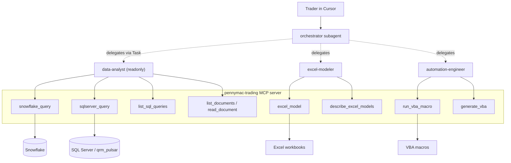
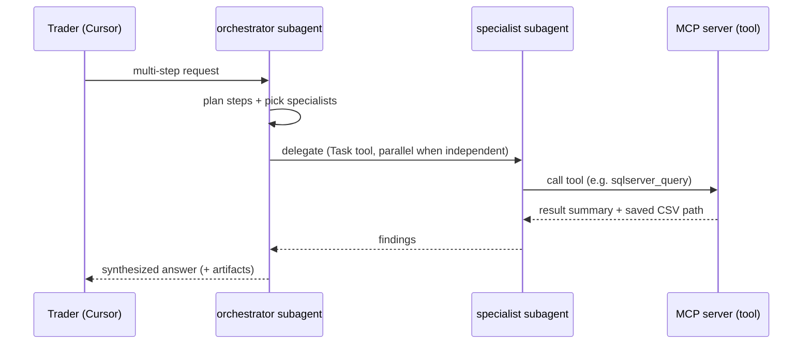

# Architecture

This project has two layers:

- **Brains — Cursor Subagents** (`.cursor/agents/*.md`): autonomous reasoners
  that run inside Cursor on your Cursor subscription (no external API key).
- **Hands — an MCP server** (`pennymac_agent.mcp_server`): a local stdio server
  exposing deterministic tools that connect to Snowflake, SQL Server, Excel, and
  VBA. Tool logic is plain Python in `src/pennymac_agent/tools/`.

Cursor connects to the MCP server via `.cursor/mcp.json`; subagents call the
tools through that connection.

---

## 1. Components

---

## 2. Request flow

Independent steps fan out in parallel; dependent steps chain by passing a saved
CSV path from the data-analyst to the excel-modeler.

---

## 3. Why this design
- **No LLM key/gateway**: reasoning runs on the user's Cursor plan — this is the
  main reason we moved off a standalone Python agent framework.
- **Deterministic, auditable tools**: the MCP tools are plain functions with a
  read-only SQL guardrail; the model can't run destructive SQL.
- **Same domain logic**: connections, named-query libraries, the Excel registry,
  and the knowledge docs carry over unchanged — only the orchestration/LLM layer
  changed.
- **Constraint**: subagents run interactively inside Cursor, not as a headless
  service.

---

## 4. Module map

| Path | Responsibility |
|------|----------------|
| [.cursor/agents/orchestrator.md](.cursor/agents/orchestrator.md) | Master agent: plan + delegate + synthesize. |
| [.cursor/agents/data-analyst.md](.cursor/agents/data-analyst.md) | Read-only data specialist (Snowflake + SQL Server). |
| [.cursor/agents/excel-modeler.md](.cursor/agents/excel-modeler.md) | Drives Excel pricing models. |
| [.cursor/agents/automation-engineer.md](.cursor/agents/automation-engineer.md) | Runs/authors VBA. |
| [.cursor/mcp.json](.cursor/mcp.json) | Registers the `pennymac-trading` MCP server. |
| [src/pennymac_agent/mcp_server.py](src/pennymac_agent/mcp_server.py) | FastMCP server; registers tool functions over stdio. |
| `src/pennymac_agent/tools/snowflake_tool.py` | `snowflake_query`. |
| `src/pennymac_agent/tools/sqlserver_tool.py` | `sqlserver_query`. |
| `src/pennymac_agent/tools/excel_tool.py` | `excel_model`. |
| `src/pennymac_agent/tools/vba_tool.py` | `run_vba_macro`, `generate_vba`. |
| `src/pennymac_agent/tools/discovery_tool.py` | `list_sql_queries`, `describe_excel_models`. |
| `src/pennymac_agent/tools/docs_tool.py` | `list_documents`, `read_document`. |
| `src/pennymac_agent/tools/_sql_common.py` | Read-only guardrail, named-query loading, result persistence. |
| [src/pennymac_agent/config/settings.py](src/pennymac_agent/config/settings.py) | Settings (Snowflake, SQL Server, Excel/VBA, paths). No LLM keys. |

---

## 5. Agent context
Agents get context from:
- **Reference docs** in `knowledge/` (read via `list_documents`/`read_document`),
  including the local, git-ignored `legacy_queries/` library (~260 historical
  queries) for table/column hints.
- **Discovery tools** (`list_sql_queries`, `describe_excel_models`) for live
  resources.
- **Subagent system prompts** in `.cursor/agents/*.md` (role, conventions, the
  `vw_Pipe`/`SPP_Rule` facts, source policy).
